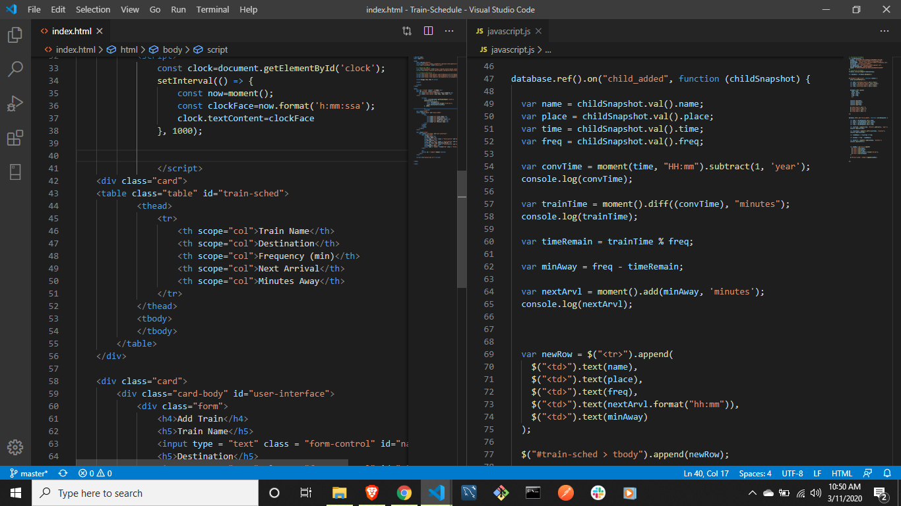

# Train Scheduler
**Author** Matt Colson

https://mc180g.github.io/Train-Schedule/

I've created a train schedule application that incorporates Firebase to host arrival and departure data. This app retrieves and manipulates this information with Moment.js. This website provides up-to-date information about various trains, namely their arrival times and how many minutes remain until they arrive at the station. This could eaily be manipulated for use in situations involving public transportation, ice cream trucks, or even tracking a stars position in the sky.

* When adding trains, users are able to submit the following:
    
    * Train Name - *inert data*
    
    * Destination - *inert data*
    
    * First Train Time -- in military time - *active data*

    * Frequency -- in minutes - *active data*

    
    
* Built With: 
* MomentJS - FrontEnd
* FireBase - BackEnd 

**Special Thanks** to Jamie DeLong who gave me 
the added wisdom I needed.